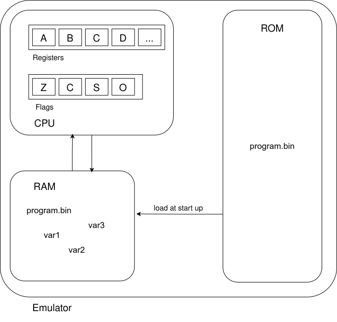

# \[untitled\] Emulator

## This is an 8-Bit emulator

### The Emulator consists of:
- an 8-Bit CPU:
  - with variable amounts of registers
  - smaller instruction set than MISC
  - fully functioning flag logic 
  - negative number support during comparisons


- variable size RAM:
  - as fast as your RAM is
  - extendable in code


- a ROM:
  - given program sits inside the ROM 
  - during startup, the ROM gets load into RAM


- a non-implemented bus system
  - not implemented yet 
  - yeah, not much to say here

### Design
- the emulator emulates a 6502-like CPU
- register `A` is considered to be the accumulator
  - `INC` and `DEC` for example perform their operations on the `A` register
- this is just a personal project, it has it's upsides and downsides



### Building and Running the emulator
Everything _should_ work out of the box.

**For UNIX-based systems:**<br>
Execute
```bash
  git clone https://github.com/xunleqitrzr/Emulator.git
  make all
```
inside the project root directory to build the emulator with Release **and** Debug configurations.<br>
The build files are inside the `build/` directory. It also contains an `easm` executable 
which<br>is an assembler used to assemble programs to machine code instructions from a given<br>
assembly file.

Assemble a program with
```bash
  ./easm <input.asm> <output.bin>
```
and execute it with
```bash
  ./EmulatorRelease <program.bin>
```

**For Windows systems:**<br>
_Prerequisites_:
- Visual Studio Version 17 (e.g. 2022)
- git

_Procedure_:
1. Open the **"Developer Command Prompt for VS"**
2. clone the repository
    ```bash
    git clone https://github.com/xunleqitrzr/Emulator.git
    ```
3. navigate into the repository directory
4. Build with MSBuild:
   ```bash
   cmake -B build -G "Visual Studio 17 2022"
   cmake --build build --config Debug          # for Debug builds 
   cmake --build build --config Release        # for Release builds
   ```
5. Build with Visual Studio:
   1. open the solution file `Emulator.sln` inside `build/` and build with Visual Studio
6. (for both options:) the binaries are inside `build/<configuration>`, either `Debug` or `Release`
   

### Important:
There are some very simple security implementations.<br>
It is no longer possible to overwrite the program from within the program itself.